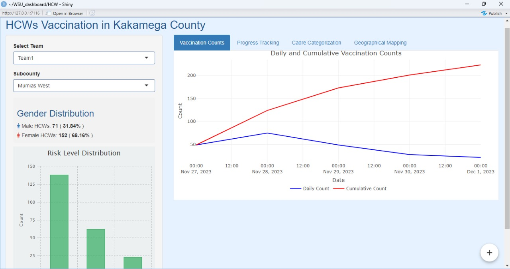
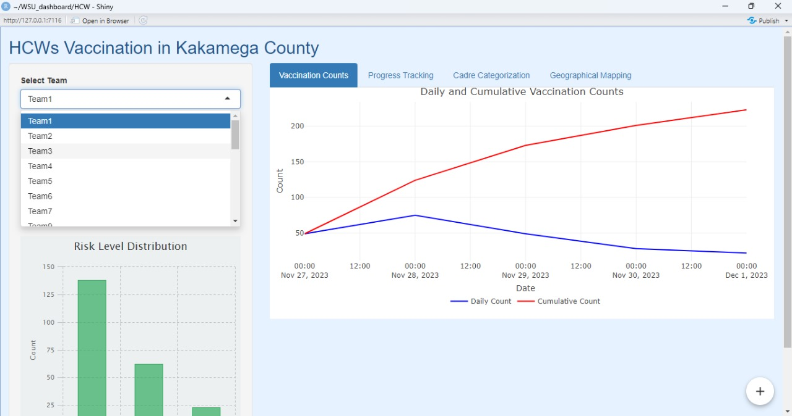

# HCWs Vaccination Dashboard

## Overview
This Shiny dashboard is designed to monitor and visualize the vaccination data of healthcare workers (HCWs) across various subcounties in Kakamega County over a specified timeframe. The dashboard provides insights into daily and cumulative vaccination counts, gender distribution, risk level distribution, professional cadre categorization, and geographical mapping of vaccination coverage within Kakamega county.

## Features
- **Dynamic Filtering**: Users can select specific vaccination teams and subcounties to view targeted data visualizations.
  
- **Vaccination Counts**: Visualization of both daily and cumulative vaccination numbers.
- **Gender Distribution**: Breakdown of vaccinated HCWs by gender, with visual representation.
- **Risk Level Summary**: Overview of the risk level distribution among vaccinated HCWs.
- **Cadre Categorization**: Detailed insights into the professional cadre of vaccinated HCWs, ranked from the most to the least common.
- **Geographical Mapping**: Interactive map showing the distribution of vaccinated HCWs by subcounty within Kakamega county.
- **Progress Tracking**: Visual representation of progress towards the vaccination target of 7,500 HCWs, displayed in numbers and percentages.

## Data Structure
The dashboard utilizes a dataset with the following structure:
- `date`: Vaccination date
- `team`: Vaccination team
- `subcounty`: Subcounty of vaccination
- `sex`: Gender of the HCW
- `age`: Age of the HCW
- `cadre`: Professional cadre of the HCW
- `risk_level`: Assessed risk level of the HCW

 ## Pass to Authenticate 
- username: user1
- password: pass1
## Installation and Usage
1. Ensure you have R and RStudio installed on your computer.
2. Install the required R packages if you haven't already: `shiny`, `shinymanager`, `dplyr`, `ggplot2`, `plotly`, `leaflet`, `DT`, `sf`, `shinyWidgets`, `highcharter`.
3. Clone this repository or download the source code to your local machine.
4. Open the project in RStudio and run the app by opening the app's main script file and clicking the "Run App" button.

## Contributing
Contributions to this project are welcome. Please feel free to fork the repository, make changes, and submit a pull request. For major changes, please open an issue first to discuss what you would like to change.

## License
This project is open-source and available under the [MIT License](LICENSE).
